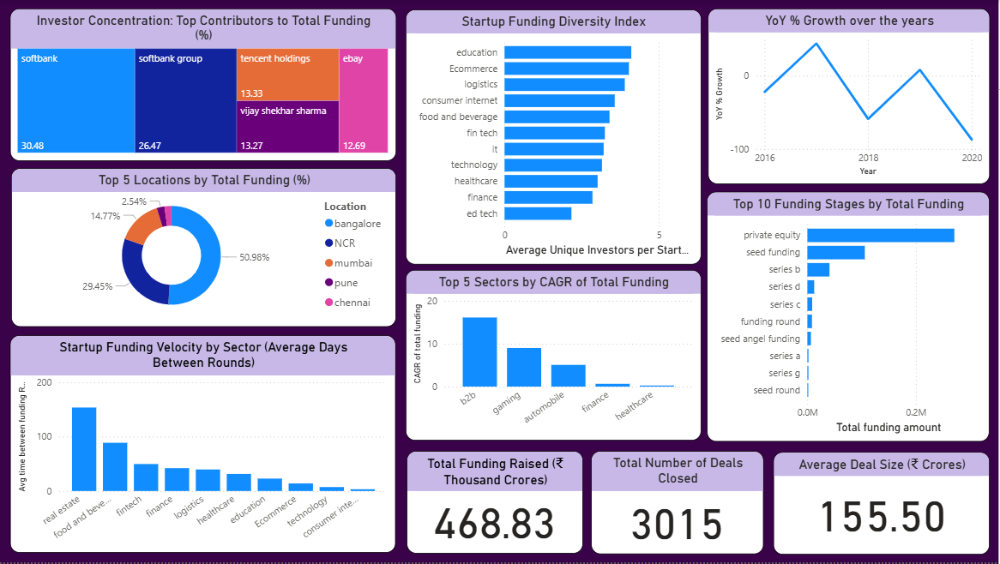

# Indian-Startup-Funding-Analysis-KPI-Driven-EDA-Clustering-and-Power-BI-Dashboard

## Objective
This project analyzes the **Indian startup ecosystem** by cleaning and exploring investment data, identifying key trends and patterns through descriptive statistics and clustering, and developing **KPI-driven dashboard** to provide actionable insights for **investors, policymakers, and entrepreneurs**.

---

## Data Source
The dataset was obtained from [Kaggle – Indian Startup Funding Dataset](https://www.kaggle.com/datasets/sudalairajkumar/indian-startup-funding).  
It contains details of funding for Indian startups, including **funding amount, investors, funding type, and location and more features**.

---

## Project Workflow
1. **Data Cleaning & Preprocessing**
   - Standardized column names
   - Removed unnecessary columns (e.g., Sr no)
   - Checked and removed duplicates
   - Fixed data types
   - Handled missing values
   - Detected and treated outliers
   - Handled inconsistencies & inaccuracies
   - Unit conversion

2. **Exploratory Data Analysis (EDA)**
   - **Univariate Analysis**: Distribution and frequency analysis of categorical, numerical, and datetime features
   - **Bivariate Analysis**: Relationships between funding amount and features like startup name, industry, location, investment type, etc.
   - Identified **leaders, laggards, volatility, stability, and risk profiles**

3. **Clustering**
   - Startups were grouped into funding clusters to identify **early-stage vs. later-stage funding patterns**
   - Median funding amounts varied significantly (from ₹55.25 Cr to ₹27,200 Cr across clusters)

4. **SQL KPIs & Dashboarding**
   - Developed interactive dashboards in **Power BI**
   - Key metrics include **Total Funding, Deal Count, Average Deal Size, YoY Growth, Top Sectors, Top Locations, Investor Concentration, Funding Velocity, and Diversity Index**

---

## Key Insights
- **Funding Distribution**: Highly skewed with a few very large deals pushing averages upwards.
- **Top Locations**: Bangalore, Delhi-NCR, and Mumbai dominate with ~80% of total funding.
- **Top Sectors**: Consumer Internet and FinTech attract the majority of investments.
- **Investment Stages**: Most deals happen at **Seed Funding** (risky) and **Private Equity** (late-stage, safer).
- **Funding Clusters**: Clear segmentation of startups by funding scale – from small to massive investments.
- **Data Gaps**: ~57% of records had missing dates, limiting accurate YoY trend analysis.

---

## SQL KPIs Implemented
1. **Total Funding Raised (₹ Thousand Crores)**
2. **Total Number of Deals Closed**
3. **Average Deal Size (₹ Crores)**
4. **YoY% Growth in Funding**
5. **Top 10 Funding Stages by Total Funding**
6. **Top 5 Sectors by CAGR of Total Funding**
7. **Top 5 Locations by Total Funding**
8. **Investor Concentration Index**
9. **Startup Funding Velocity (Avg Days Between Rounds)**
10. **Funding Diversity Index by Sector**
---

## Dashboard
The interactive **Power BI Dashboard (`4_Dashboarding.pbix`)** provides a comprehensive view of the **10 SQL KPIs** implemented in this project.  
It visually tracks key metrics computed using MySQL enabling stakeholders to quickly derive insights.  

---

## Recommendations
- Use **Median Funding** along with averages to avoid skewed interpretations.
- Validate unusually large funding values (e.g., ₹33,150 Cr in Series B).
- Attempt to enrich missing dates from external sources for accurate trend analysis.
- Encourage investment in **non-metro cities and underfunded sectors** for ecosystem balance.
- Always contextualize averages with **deal counts** for clarity.

---

## Project Files
- `1_Data_cleaning_and_EDA.ipynb` → Data cleaning & EDA notebook
- `2_clustering.ipynb` → Clustering analysis notebook
- `3_KPIs.txt` → SQL queries for KPIs
- `4_Dashboarding.pbix` → Power BI dashboard
- `5_Report.pdf` → Detailed project report

---

## Tech Stack
- **Python** (Pandas, NumPy, Matplotlib, Seaborn, Scikit-learn)
- **SQL** (for KPI computation)
- **Power BI** (for dashboarding & visualization)
---

## Key Conclusions
- Large deals distort averages → Median should always be checked.  
- Startup funding is concentrated in **Bangalore, Delhi-NCR, and Mumbai**.  
- Consumer Internet & FinTech dominate funding sectors.  
- Early-stage & late-stage funding dominate, while mid-stage funding is less frequent.  
- Clustering shows diverse funding requirements across startups.  
---

## 👤 Author
**Diya**  
Aspiring Data Analyst | Python • SQL • Power BI • Statistics 

---
